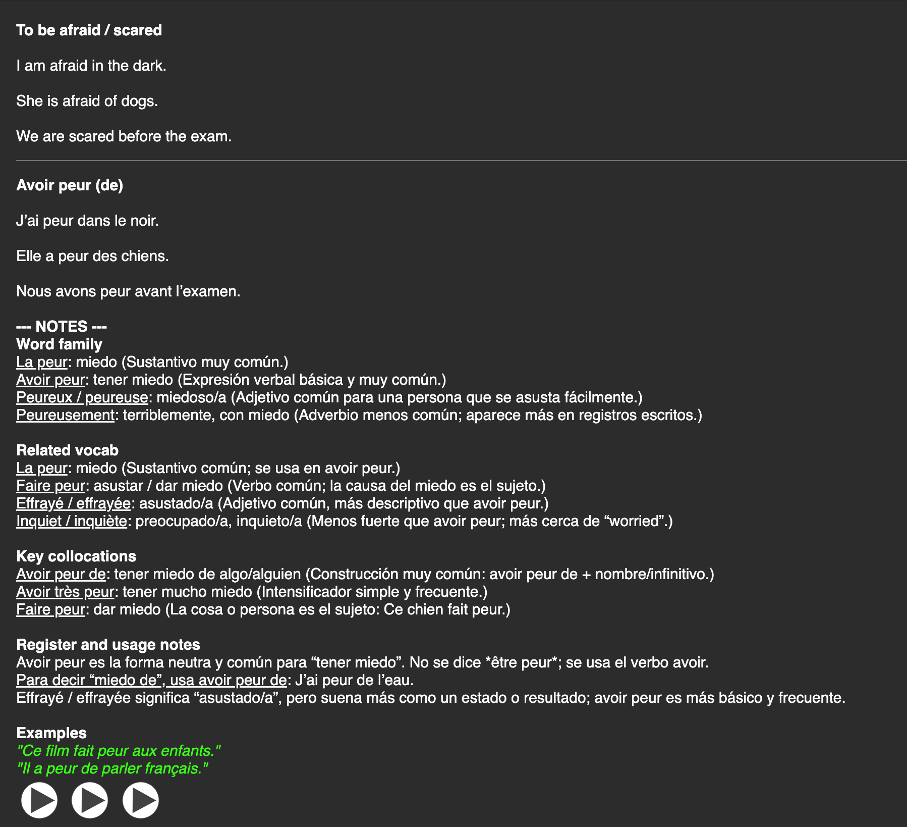

# anki-auto

Automating Anki flashcard creation. You type whatever you want to learn - and the program will take care of the rest.

## What does it do

- Cleans up and normalizes your raw input to a core concept.
- Creates practice sentences for the card.
- Provides extensive notes and valuable information related to the concept.
- Generates an AI audio file for the sentences.
- Formats and refines the card with colors, spaces, underlines.
- Packages the cards int a `.apkg` file - just drag and drop into Anki.

## Theory

My idea for a high quality flashcard for language learning has to consist of these 3 main points:

- **Context**: learning not only the word itself, but how it connects and used naturally in real sentenes.
- **Target language at the back**: forces you to generate the taget word and sentences on your own, making you actively produce and think in the target language.
- **Extensive notes**: increasing the value of each card by adding related words, synonyms and antonyms, and more examples. for example in Spanish - why learn "Recordar" only, when you can add "Acordarse", "Recuerdo" and "Recordatorio".

However, I also believe every person is different and has their own preferences, and should adopt their own personal strategy and systems for language learning. A single "best strategy" doesn't exist and depends only yourself. Therefore, you are welcome to fork this repo and make any changes to the code to suit your personal objectives better.

## Features

- General support for all languages.
- Fully costumizable - choose your AI model, voice, CEFR level, and more.
- Allows for easy batch generation of many cards.
- Clean logging and error handling.
- Concurrency for faster generations.

## Example card

Only input "to be afraid / scared", A2 CEFR level.  
Set English front, French back, Spanish notes.  
Model used: `gpt-5.5-2026-04-23`.  
No extra formatting / styling was done.



## How to use

### Prerequisites

- **Python 3.10+**.
- **An OpenAI API key** — create one at [platform.openai.com/api-keys](https://platform.openai.com/api-keys) and set it as `OPENAI_API_KEY` (see [Variables](#variables)).
- Reference for the model/voice variables:
  - Text models (`ANKI_TEXT_MODEL`, `ANKI_AUDIO_MODEL`): [platform.openai.com/docs/models](https://platform.openai.com/docs/models).
  - Voices (`ANKI_AUDIO_VOICE`): [Text-to-speech guide](https://platform.openai.com/docs/guides/text-to-speech).

### Get the source code

1. Clone this repo:

   ```bash
   git clone https://github.com/liav-hasson/anki-auto.git
   cd anki-auto
   ```

2. Install dependencies:

   ```bash
   python3 -m venv .venv
   source .venv/bin/activate
   python3 -m pip install -e .
   ```

### Setup environment

1. Copy the example environment file:

   ```bash
   cp .env.example .env
   ```

2. Set the required variables in `.env` (read below for the [value guide](#variables)).

### Add your input and run

1. Create the file named by `ANKI_INPUT_PATH` (default `items.txt`) with one loose input item per line:

    ```text
    dog
    to remember (use the word "bartender" in a sentence)
    # lines are ignored with this prefix
    at the train station
    I would like a coffee
    ```

2. Run the program:

   ```bash
   anki-auto
   ```

3. Import or drag the generated file to Anki deck, review the created cards - done.

## Variables

| Variable | Description | Required | Default | Accepted values |
| --- | --- | --- | --- | --- |
| `OPENAI_API_KEY` | OpenAI API key for card + audio generation. | **Yes** | — | Your secret key (`sk-...`) |
| `ANKI_ORIGIN_LANGUAGE` | Language on the **front** of the card (a language you know). | **Yes** | — | Any language name, e.g. `Spanish` |
| `ANKI_TARGET_LANGUAGE` | Language on the **back** (the language you are learning). Must differ from origin and notes. | **Yes** | — | Any language name, e.g. `French` |
| `ANKI_NOTES_LANGUAGE` | Language the notes are written in. | **Yes** | — | Any language name, e.g. `English` |
| `ANKI_CEFR_LEVEL` | Target proficiency level; drives sentence difficulty. | **Yes** | — | `A1` `A2` `B1` `B2` `C1` `C2` (case-insensitive) |
| `ANKI_TEXT_MODEL` | OpenAI model used to generate card text. | No | `gpt-4.1-mini` | Any [text model](https://platform.openai.com/docs/models) id. Better models generally produce better sentences and notes. |
| `ANKI_AUDIO_MODEL` | OpenAI model used for text-to-speech. | No | `gpt-4o-mini-tts` | Any [TTS model](https://platform.openai.com/docs/models) id |
| `ANKI_AUDIO_VOICE` | Voice used for audio. | No | `alloy` | A [supported voice](https://platform.openai.com/docs/guides/text-to-speech) (e.g. `alloy`, `echo`, `nova`, `shimmer`) |
| `ANKI_DECK_NAME` | Name of the generated Anki deck. | No | `Anki Auto Deck` | Any text |
| `ANKI_INPUT_PATH` | Path to the input file (one item per line; blank and `#` lines are ignored). | No | `items.txt` | Any file path |
| `ANKI_OUTPUT_PATH` | Path of the generated `.apkg`. | No | `deck.apkg` | Any file path |
| `ANKI_CONCURRENCY` | Number of parallel OpenAI requests. Higher is faster but hits rate limits sooner. | No | `5` | Integer `>= 1` |
| `ANKI_GENERATE_AUDIO` | Generate audio for each main example sentence. | No | `true` | boolean* |
| `ANKI_DRY_RUN` | Print card JSON and skip building the `.apkg`. | No | `false` | boolean* |
| `ANKI_MINIMAL_CARDS` | Sentences only (core + examples, no notes). | No | `false` | boolean* |
| `ANKI_ASSUME_YES` | Skip the confirmation prompt (for automation / non-interactive use). | No | `false` | boolean* |
| `ANKI_OVERWRITE_OUTPUT` | Overwrite an existing output file instead of writing `<name>_1.apkg`. | No | `false` | boolean* |

\* **boolean** accepts (case-insensitive): `true`/`false`, `1`/`0`, `yes`/`no`, `on`/`off`, `t`/`f`, `y`/`n`.
